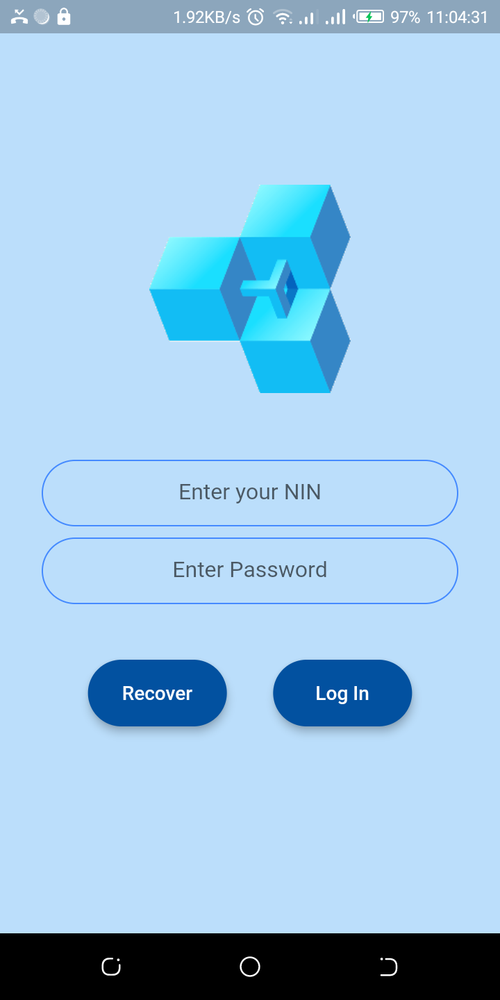
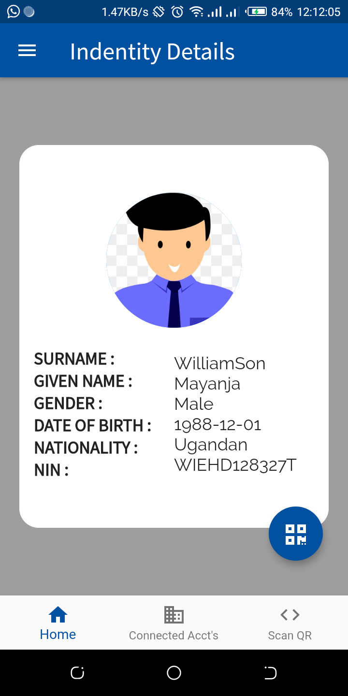
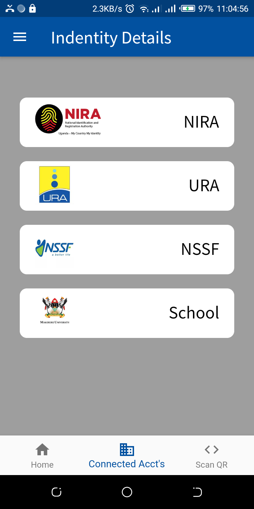
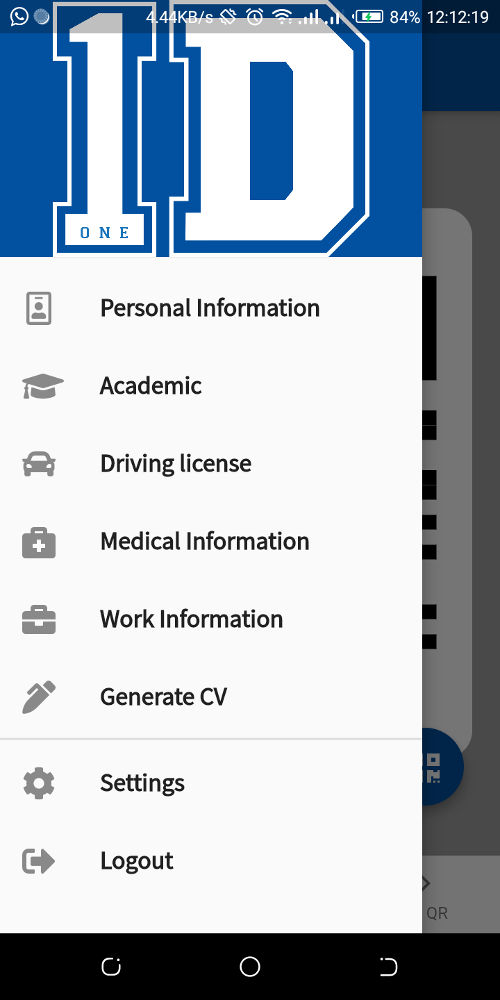
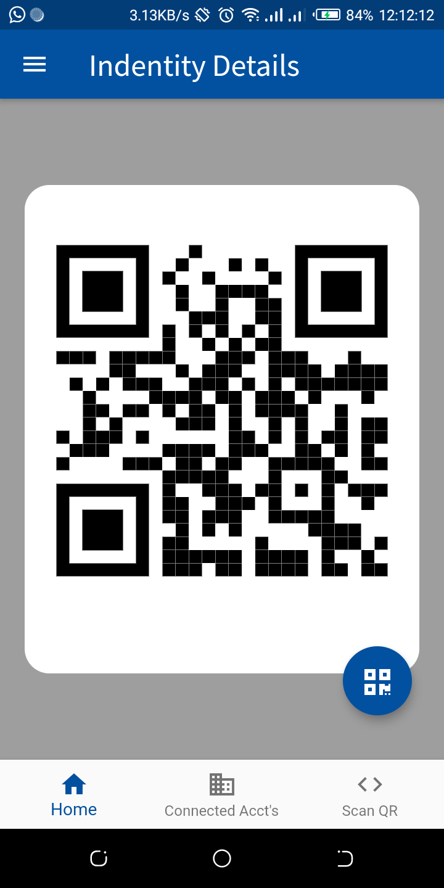
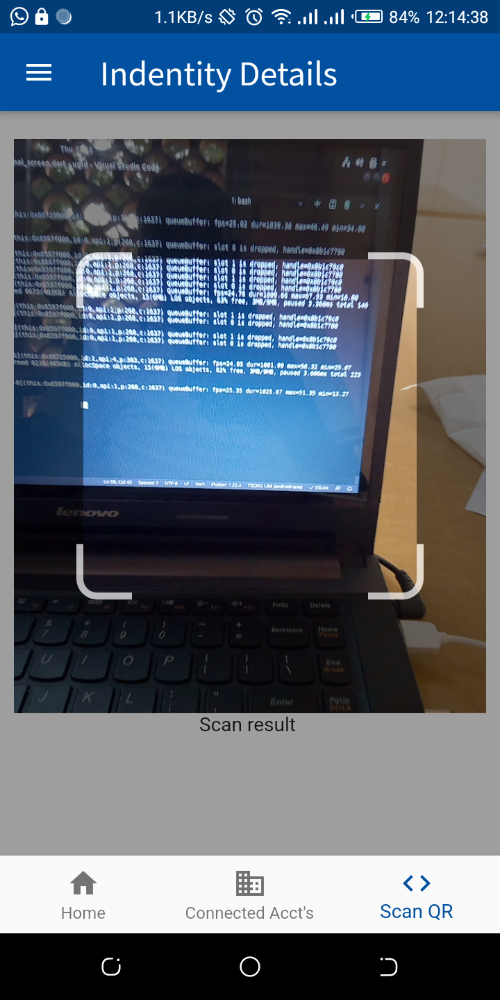

# UG Profile ID

This flutter project is a mobile dApp deployed to ethereum blockchain.

## Look and Feel

### Login Screen

### Personal Details Screen 

    

### Connected accounts' Screen 

    

### Drawer options 

### QR code generated for seected details. 

    

### Scanning Screen.

    

## About the application. 
The flutter application acts as digital profile ID, whereby a user can have all their Identity cards in one.
The User can also upload documents on the app to act as proof, ( of which are uploaded on [IPFS](https://ipfs.io/) and the hash kept on blockchain). 

### NOTE: This is not the final version.
 

### How to run the Application.
1. Start the local blockchain [Ganache](https://www.trufflesuite.com/ganache).

2. Import the tuffle.config.js file to Ganache workspace.

3. Edit the rpc and ws urls with the one being used by ganache (Probably this should be the WI-FI ) so that they are running on the same network.

4. Start the web Application to enter the data.

5. Start the mobile App and use it.

### Credit. 
I used these resources to get my application up and running.

From [MTECHVIRAL](https://youtu.be/3Eeh3pJ6PeA) Youtube channel, I got the necessary hints, it was very instrumental, KUDOS.

## Flutter resources.
A few resources to get you started if this is your first Flutter project:

- [Lab: Write your first Flutter app](https://flutter.dev/docs/get-started/codelab)
- [Cookbook: Useful Flutter samples](https://flutter.dev/docs/cookbook)

For help getting started with Flutter, view our
[online documentation](https://flutter.dev/docs), which offers tutorials,
samples, guidance on mobile development, and a full API reference.